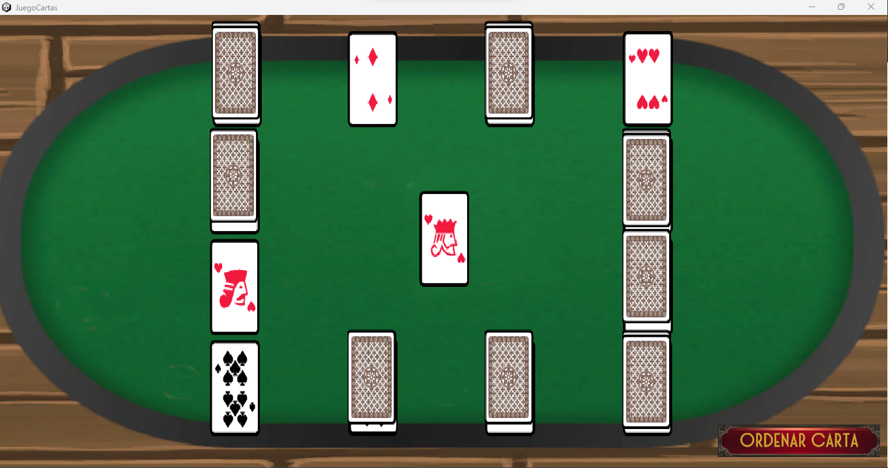

# Juego de cartas (Unity)
Juego de ordenamiento automatico de cartas realizado en Unity.
# Descripción
El juego de ordenamiento de cartas posee la opción de barajar las cartas por la técnica de pila o la técnica rapida y en base al orden final de las cartas, se ubica cada carta en su posición en sentido horario de izquierda a derecha hasta que no se pueda ordenar ninguna cartas.
# Versión de Unity utilizada
- Unity 2022.1.23f1
# Captura de pantalla

# Recursos de terceros utilizados
- Sprite de cartas: - https://opengameart.org/content/cards-set
- Sprite de botones: https://opengameart.org/content/buttons-and-frame
# Licencia
GPLv3
